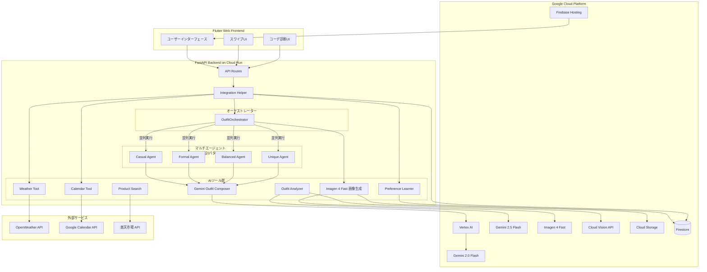
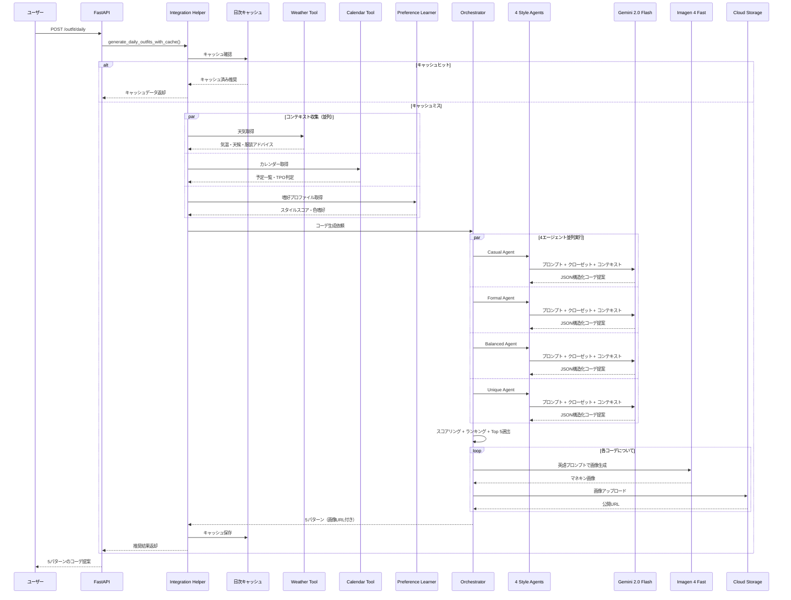
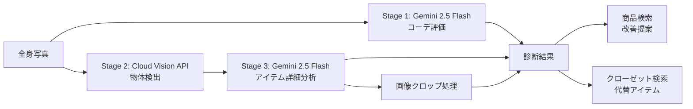

# Rakufuku（ラクフク） AI機能 技術概要

## 1. プロジェクト概要

**Rakufuku（ラクフク）** は、Google Cloud AI技術を全面活用したマルチエージェント型コーディネート提案アプリです。Vertex AI上のGemini・Imagen・Cloud Visionを中核に、4つの専門スタイルエージェントが並列協調でコーディネートを生成する、Agentic AIアーキテクチャを採用しています。

### 課題: 毎朝の服選びは「多変数最適化問題」

「今日、何を着よう？」--- この日常の問いは、実は **天気（気温・降水）、予定（TPO）、手持ちの服、個人の好み** という4つ以上の変数を同時に考慮する多変数最適化問題です。人間が毎朝直感で行っているこの判断を、多くの人が「面倒」「難しい」と感じていながら、既存サービスでは解決されていません。

Rakufukuはこの課題を **マルチエージェントAI** で解決します：

- **「毎朝、何を着ればいいかわからない」問題** --- 天気・予定・手持ちの服を考慮した意思決定をAIが代行
- **クローゼットの死蔵アイテム** --- 手持ちの服の新しい組み合わせを発見し、活用率を向上
- **TPOミスマッチ** --- カレンダー連携で「商談なのにカジュアルすぎる」事故を防止
- **ファッション学習コスト** --- スワイプ操作だけでAIがユーザーの好みを自動学習

---

## 2. システムアーキテクチャ

### 2.1 全体構成図



### 2.2 Google Cloud技術の活用マップ

| Google Cloudサービス | 用途 | 選定理由 |
|---|---|---|
| **Vertex AI** | モデルホスティング・推論基盤 | Gemini/Imagen統一管理、ADK設定共有 |
| **Gemini 2.0 Flash** | コーディネート生成（テキスト推論） | 高速・低コスト、JSON構造化出力対応 |
| **Gemini 2.5 Flash** | コーデ診断（マルチモーダル） | 画像+テキスト入力、高精度ビジョン |
| **Imagen 4 Fast** | マネキン画像生成 | 高速生成、フォトリアリスティック品質 |
| **Cloud Vision API** | 服飾アイテム検出 | Object Localization、高精度座標 |
| **Cloud Firestore** | ユーザーデータ・キャッシュ・履歴 | リアルタイム同期、スキーマレス |
| **Cloud Storage** | 生成画像の保存・配信 | 公開URL、CDN連携 |
| **Firebase Hosting** | フロントエンドSPA配信 | グローバルCDN、Flutter Web対応 |
| **Cloud Run** | バックエンドAPIホスティング | コンテナベース、オートスケール |

### 2.3 マルチエージェントアーキテクチャ

Rakufukuは **Google ADK（Agent Development Kit）** の設計パターンを参考にした4つの専門スタイルエージェントを採用しています。ADKは設定管理（`adk_config.py`）としてVertex AIプロジェクト・リージョン・モデル設定を一元管理する役割を担い、各エージェントはこの共通設定を取得して独自のペルソナで並列にコーディネートを生成します。オーケストレーターがランキング・選別する構成です。なお、ADKのAgent/Runnerクラスによるランタイム実行は行わず、設計パターンと設定共有の形で統合しています。

#### ADK設定共有アーキテクチャ

```python
# adk_config.py - エージェント共通設定
AGENT_CONFIG = {
    "model": "gemini-2.0-flash-001",
    "generation_config": {
        "max_output_tokens": 2048,
        "temperature": 0.7,
    },
    "project": "rakufuku-pwa",       # GCPプロジェクト
    "location": "asia-northeast1",    # 東京リージョン
}
```

各スタイルエージェント（`BaseStyleAgent`）は `get_agent_config()` でADK設定を取得し、Vertex AI Geminiモデルとの対話を行います。エージェント固有のペルソナは `agent_persona_prompt` プロパティでオーバーライドされ、同一モデル上で異なるスタイリスト人格として振る舞います。

#### スタイルエージェント一覧

| エージェント | 役割 | ペルソナ | 得意なTPO |
|---|---|---|---|
| **Casual Agent** | リラックスした日常スタイル | デニム・Tシャツ・スニーカーを好む。アースカラー中心の着心地重視スタイリスト | 休日・友人との食事 |
| **Formal Agent** | プロフェッショナルな装い | ジャケット・ドレスシャツ・革靴。ネイビー・グレー基調の清潔感重視スタイリスト | 会議・商談・セミナー |
| **Balanced Agent** | 万能なスマートカジュアル | オフィスでもプライベートでも通用する、きれいめカジュアルのバランス追求スタイリスト | オフィスカジュアル・ちょっとしたお出かけ |
| **Unique Agent** | 個性的なトレンドスタイル | 2026年トレンドカラー（ラベンダー、テラコッタ等）を積極活用。大胆な配色やパターンミックスで差をつけるスタイリスト | ファッション感度高めのシーン |

#### オーケストレーターのロジック

`OutfitOrchestrator` は以下の戦略で最終推奨を決定します：

1. **並列実行**: `asyncio.gather(*tasks, return_exceptions=True)` で4エージェントを同時に実行し、レイテンシを最小化。一部エージェントが失敗しても他のエージェントの結果で推奨を生成可能（部分障害耐性）
2. **多様性保証**: 各エージェントから最低1つのコーディネートを選出（最大4枠）
3. **コンテキストスコアリング**: エージェントのベーススコアに対し、TPO適合度（±10%）とユーザー嗜好（±5%）の軽量調整を適用
4. **5パターン以上生成**: 4エージェント保証枠 + 残りスコア上位で合計5つ以上を選出
5. **おすすめマーキング**: 最高スコアのコーディネートに `is_recommended: true` を付与

---

## 3. AI技術スタック

### 3.1 使用技術一覧

| 技術 | モデル / サービス | 用途 | 選定理由 |
|---|---|---|---|
| **Gemini 2.0 Flash** | `gemini-2.0-flash-001` | コーディネート生成・評価 | 高速推論・低コスト・JSON構造化出力（`response_mime_type="application/json"`） |
| **Gemini 2.5 Flash** | `gemini-2.5-flash` | ビジョン評価（コーデ診断・アイテム詳細分析） | マルチモーダル入力対応、画像+テキスト統合推論 |
| **Imagen 4 Fast** | `imagen-4.0-fast-generate-001` | マネキン画像生成（9:16縦長） | 高速版による生成速度重視、フォトリアリスティック品質 |
| **Cloud Vision API** | Object Localization | 全身写真からの服飾アイテム検出 | 高精度バウンディングボックス、40種以上のアイテム対応 |
| **Vertex AI** | SDK基盤 + ADK設定共有 | 上記モデル群のホスティング・推論基盤 | 統一的なモデル管理、東京リージョン（asia-northeast1） |
| **Firestore** | NoSQL DB | ユーザーデータ・嗜好・キャッシュ・履歴 | リアルタイム同期、日次キャッシュ管理 |
| **Cloud Storage** | オブジェクトストレージ | 生成マネキン画像の保存・配信 | 公開URL自動発行、CDN連携 |
| **Firebase Hosting** | CDN | Flutter Web SPA配信 | グローバルCDN、SPA rewrites対応 |
| **Cloud Run** | コンテナ実行 | FastAPIバックエンド | マルチステージDockerビルド、オートスケール |

### 3.2 費用対効果を考慮したモデル選定

Rakufukuは「毎朝使うアプリ」という特性上、**コストと速度の最適化** を重視してモデルを選定しています：

- **Gemini 2.0 Flash**: テキストベースのコーデ生成には最速・最低コストのFlashモデルを採用。JSON構造化出力により後処理も不要
- **Gemini 2.5 Flash（2.0 Proではなく）**: 診断機能のマルチモーダル入力にもFlashモデルを使用。Proレベルの精度は不要で、速度とコストを優先
- **Imagen 4 Fast（通常版ではなく）**: 高速生成版を選択し、ユーザー待ち時間を短縮。マネキン画像という用途にはFast版の品質で十分

### 3.3 各技術の使い分けと連携

```
コーデ提案パイプライン:
  Gemini 2.0 Flash → コーデ生成（テキスト推論、JSON構造化出力）
  Imagen 4 Fast → 生成コーデのマネキン画像化（ビジュアルプレビュー）

コーデ診断パイプライン:
  Gemini 2.5 Flash → 全身写真のコーデ評価（マルチモーダル入力）
  Cloud Vision API → 物体検出でアイテム位置特定（バウンディングボックス）
  Gemini 2.5 Flash → 検出アイテムの色・素材・詳細分析（マルチモーダル入力）
```

**Gemini 2.0 Flash** はテキストベースの高速推論に特化し、コーディネートの組み合わせロジックを担当。**Gemini 2.5 Flash** は画像を含むマルチモーダル入力が必要な診断機能に使用。**Imagen 4 Fast** はテキストプロンプトからフォトリアリスティックなマネキン着用画像を生成します。

---

## 4. コーデ提案パイプライン

### 4.1 フロー図



### 4.2 各ステップの詳細

#### Step 1: 天気取得（OpenWeather API）

`weather_tool` がOpenWeather APIから現在地の天気情報を取得します。

- **取得データ**: 気温、体感温度、天候、湿度
- **付加情報**: 天気に基づく服装アドバイス（例: 「雨対策に防水素材がおすすめ」「厳しい寒さです。厚手のアウターを」）
- **フォールバック**: API失敗時は気温20度・晴れをデフォルト値として使用

#### Step 2: TPO判定（Google Calendar API）

`calendar_tool` がGoogle Calendar APIからユーザーの当日予定を取得し、TPO（Time, Place, Occasion）を自動判定します。

- **イベント分類**: タイトル・説明文のキーワードから自動分類（`client_meeting`, `meeting`, `date`, `exercise`, `casual`, `other`）
- **フォーマル度判定**: 最もフォーマルな予定に合わせて `formal` / `business_casual` / `casual` を決定
- **優先度マッピング**: `client_meeting(4) > meeting(3) > date(2) > casual(1) > exercise(0)`

#### Step 3: 嗜好プロファイル取得

`preference_learner` がFirestoreからユーザーの嗜好プロファイルを取得します。

- **4次元スタイルスコア**: casual / formal / balanced / unique（各0-100）
- **カラー嗜好**: 色ごとの好み度（0-100）
- **カテゴリ別アイテム嗜好**: 各カテゴリ内のアイテム使用傾向
- **統計情報**: 総スワイプ数、承認率

#### Step 4: 4エージェント並列生成（Gemini 2.0 Flash on Vertex AI）

各スタイルエージェントが `compose_outfit_with_gemini()` を呼び出し、Vertex AI上のGemini 2.0 Flashに対してJSON構造化出力を要求します。

**プロンプト構成**:
- システムプロンプト: エージェント固有のペルソナ（スタイリスト人格）--- ADK設定から取得
- ユーザープロンプト: クローゼットアイテム一覧 + 天気 + TPO + ユーザー嗜好 + 性別
- 出力形式: `response_mime_type="application/json"` によるJSON強制出力

**Geminiの出力内容**:
- `selected_items`: 選択アイテム（クローゼット / 外部購入）
- `reasoning`: 日本語での選定理由（3-5文）
- `image_prompt_en`: 英語での画像生成用プロンプト
- `confidence_score`: 信頼度スコア（0-100）

**クローゼット vs 外部アイテム**:
- クローゼットに適切なアイテムがあればそれを使用（`item_source: "closet"`）
- 不足している場合は外部購入アイテムを具体的に提案（`item_source: "external"`）
- 外部アイテムには楽天市場・Amazon・ZOZOTOWNの検索リンクを自動生成

#### Step 5: スコアリングとランキング

オーケストレーターが全エージェントの提案を統合評価します。

```
最終スコア = ベーススコア(Gemini) + TPOボーナス(±10) + 嗜好ボーナス(±5)
```

- **TPOボーナス**: エージェントタイプとTPO要求のマッチ度（例: formal x formal = +10, casual x formal = -5）
- **嗜好ボーナス**: ユーザーのスタイルスコアとの一致度（50基準、100で+5、0で-5）
- **多様性保証**: 各エージェントから最低1つを確保した上で、スコア上位で5つ以上を選出

#### Step 6: マネキン画像生成（Imagen 4 Fast on Vertex AI）

各コーディネートについて、Vertex AI上のImagen 4 Fastでフォトリアリスティックなマネキン着用画像を生成します。

- **プロンプト構成**: Geminiが生成した英語の `image_prompt_en` を活用（日本語混入を回避）
- **画像仕様**: 9:16縦長、白背景スタジオ撮影風、全身フルボディ
- **品質制御**: 「1体のマネキンのみ」「服は全て着用状態」「フラットレイ禁止」などの制約をプロンプトに明記
- **アップロード**: 生成画像をCloud Storageにアップロードし、公開URLを返却

---

## 5. コーデ診断パイプライン

### 5.1 4段階ビジョンパイプライン

ユーザーが全身写真をアップロードすると、4段階のAI分析パイプラインが実行されます。



#### Stage 1: コーデ総合評価（Gemini 2.5 Flash）

全身写真をGemini 2.5 Flashのマルチモーダル入力に渡し、プロのスタイリスト視点で評価します。

- **スコア**: 0-10の総合スコア
- **良い点**: 最大3つ（例: 「色の組み合わせが良い」「シルエットがきれい」）
- **改善提案**: 最大3つ（具体的なカテゴリ・色・スタイルを含む）
- **スタイル判定**: 全体のスタイル分類（カジュアル、ビジネスカジュアル等）
- **色合わせ評価**: 配色の調和度コメント
- **コンテキスト対応**: 天気・気温・予定を考慮した評価

#### Stage 2: 物体検出（Google Cloud Vision API）

Cloud Vision APIのObject Localizationで、写真内の服飾アイテムを自動検出します。

- **検出対象**: 40種類以上の服飾アイテム（シャツ、パンツ、ジャケット、靴、アクセサリー等）
- **出力情報**: カテゴリ、アイテム名（日本語）、信頼度、バウンディングボックス（正規化座標）
- **フォールバック**: Cloud Vision API失敗時はGemini 2.5 Flashによるアイテム推測に自動切り替え

#### Stage 3: アイテム詳細分析（Gemini 2.5 Flash）

Stage 2で検出されたアイテムの詳細（色、素材感）をGemini 2.5 Flashで分析します。

- **入力**: 全身画像 + 検出アイテムリスト
- **出力**: 各アイテムの具体的な名前（例: 「ネイビーテーラードジャケット」）、色（日本語）、素材感の推測

### 5.2 画像クロップとクローゼット登録

Stage 2のバウンディングボックスを使用し、PILで各アイテムを個別にクロップします。

- **パディング**: 5%の余白を追加して自然な切り抜き
- **出力**: Base64エンコードされたクロップ画像
- **用途**: クローゼットへの一括登録（`/closet/items/bulk` API）に使用可能

### 5.3 改善提案のロジック

診断結果の改善提案に基づき、2つのアプローチで代替アイテムを提案します。

1. **クローゼット検索**: ユーザーのクローゼットから改善カテゴリ・色に合うアイテムを検索
2. **商品検索**: 楽天市場・Amazon・ZOZOTOWN のアフィリエイトリンクを自動生成。楽天APIによる実商品検索も対応

---

## 6. 嗜好学習システム

### 6.1 EMA（指数移動平均）ベースの学習

ユーザーのスワイプ操作（承認/却下）から暗黙的にファッション嗜好を学習します。

```
新スコア = 現在スコア * (1 - α) + 報酬 * α
```

- **学習率（α）**: `STYLE_SCORE_ALPHA = 0.1`
- **報酬**: 承認 = 100、却下 = 0
- **初期値**: 全スタイル = 50.0（ニュートラル）

EMAにより、直近のスワイプに重みを置きつつ過去の傾向も保持するバランスの良い学習が実現されています。

### 6.2 スワイプからの暗黙的フィードバック

ユーザーは「いいね」「いまいち」のスワイプだけで、以下の4次元の嗜好が同時に更新されます。

| 学習対象 | 更新ロジック | パラメータ |
|---|---|---|
| **スタイルスコア**（4次元） | EMA。承認されたエージェントタイプのスコアが上昇 | α = 0.1 |
| **カラー嗜好** | 承認アイテムの色に +5、却下で -5 | δ = 5 |
| **アイテム嗜好** | クローゼットアイテムのカテゴリ別使用傾向 | δ = 1 |
| **フォーマリティ分布** | 承認されたエージェントのフォーマル度をカウント | カウント +1 |

### 6.3 嗜好プロファイル構造

```json
{
  "style_scores": {
    "casual": 62.5,
    "formal": 45.0,
    "balanced": 55.0,
    "unique": 38.0
  },
  "color_preferences": {
    "ネイビー": 75,
    "ホワイト": 65,
    "ブラック": 55
  },
  "category_preferences": {
    "tops": { "item_abc": 3, "item_def": -1 },
    "bottoms": { "item_ghi": 2 }
  },
  "formality_distribution": {
    "casual": 12,
    "business_casual": 8,
    "formal": 3
  },
  "total_swipes": 23,
  "approve_rate": 0.6087
}
```

---

## 7. コンテキストインテリジェンス

### 7.1 天気API連携（OpenWeather）

`weather_tool` は OpenWeather API と連携し、リアルタイムの気象情報を取得します。

| 取得データ | 用途 |
|---|---|
| 気温（℃） | 季節・レイヤリング判断（<10°C: 厚手アウター、10-15°C: 軽いアウター、>25°C: 通気性重視） |
| 体感温度 | 実際の寒暖感に基づく服装アドバイス |
| 天候（晴れ/雨/雪等） | 素材推奨（雨→防水素材、雪→防水ブーツ） |
| 湿度 | 高湿度時のさらっとした素材推奨 |

### 7.2 Googleカレンダー連携（TPO自動判定）

`calendar_tool` は Google Calendar API v3 と連携し、当日の予定からTPOを自動判定します。

**キーワードベースのイベント分類**:

| 分類 | 検出キーワード例 | フォーマル度 |
|---|---|---|
| `client_meeting` | クライアント、商談、提案、プレゼン | formal |
| `meeting` | 会議、MTG、定例、面談、1on1 | business_casual |
| `date` | デート、記念日 | casual+ |
| `exercise` | ジム、ランニング、ヨガ | casual(運動着) |
| `casual` | ランチ、飲み会、友人、カフェ | casual |

最もフォーマルな予定に合わせて全体のフォーマル度を決定します（安全側に寄せる設計）。

### 7.3 TPO x 天気 x 嗜好の三要素スコアリング

最終的なコーディネートスコアは、3つのコンテキスト要素を統合して算出されます。

```
最終スコア = Geminiベーススコア + TPOボーナス(±10) + 嗜好ボーナス(±5)
```

各エージェント内のフォールバックスコアリングでは、さらに詳細な重み付けが行われます：

| 評価要素 | 重み | 評価内容 |
|---|---|---|
| 天気適合度 | 30% | 気温範囲・季節の一致 |
| TPOマッチ | 40% | フォーマル度の一致 |
| 嗜好一致度 | 20% | スタイルスコア・カラー嗜好との一致 |
| スタイル信頼度 | 10% | エージェント自身の得意度 |

---

## 8. レジリエンス設計

### 8.1 多層フォールバック戦略

システム全体にわたり、各コンポーネントが独立してフォールバック可能な本番品質の設計を採用しています。外部APIやAIモデルの障害がユーザー体験を完全に中断させることはありません。

| レイヤー | 正常動作 | フォールバック |
|---|---|---|
| **天気取得** | OpenWeather API | 気温20°C・晴れのデフォルト値 |
| **カレンダー** | Google Calendar API | casual TPOをデフォルト |
| **嗜好プロファイル** | Firestore取得 | 全スタイル50点の初期プロファイル |
| **コーデ生成** | Gemini 2.0 Flash | ルールベースの決定論的選択 |
| **画像生成** | Imagen 4 Fast | フロントエンドの組み込みプレースホルダー |
| **アイテム検出** | Cloud Vision API | Gemini 2.5 Flashによるアイテム推測 |
| **商品検索** | 楽天API実商品検索 | アフィリエイトリンク生成 |
| **エージェント障害** | 4エージェント全て成功 | 成功したエージェントの結果のみ使用 |

**エージェントレベルの耐障害性**: `asyncio.gather(*tasks, return_exceptions=True)` により、一部エージェントが失敗しても他のエージェントの結果で推奨を生成可能。最悪の場合でも1エージェントが成功すれば、ユーザーにコーディネートを提供できます。

### 8.2 キャッシュ戦略

```
日次キャッシュ（Firestore）
  ├─ キー: users/{user_id}/daily_recommendations/{YYYY-MM-DD}
  ├─ 有効期限: 翌日0時（JST）
  ├─ 内容: 推奨コーデ + コンテキスト（天気・TPO・嗜好）
  └─ 更新: force_regenerateフラグで強制再生成可能

ティア管理（Firestore）
  ├─ キー: users/{user_id}/tier_usage/current
  ├─ Free: 1回/日（現在は無制限に設定）
  ├─ Premium: 999回/日
  └─ 日次リセット: 0時（JST）自動リセット
```

初回アクセスでコーデを生成・キャッシュし、同日の再アクセスではキャッシュから即座に返却。ユーザーが「もう一度提案して」を選択すると `force_regenerate` で新規生成します。日次キャッシュにより、Gemini/Imagenの不要な再呼び出しを防ぎ、APIコストを最小化しています。

---

## 9. API一覧

### 9.1 主要エンドポイント

| メソッド | エンドポイント | 機能 | 認証 |
|---|---|---|---|
| `POST` | `/outfit/daily` | 日次コーデ提案（5パターン以上） | Bearer Token（オプション、カレンダー連携時に使用） |
| `POST` | `/outfit/regenerate` | コーデ強制再生成 | Bearer Token（オプション） |
| `POST` | `/outfit/recommend` | コーデ提案（レガシー互換） | Bearer Token |
| `POST` | `/outfit/diagnose` | 全身写真コーデ診断 | 不要 |
| `POST` | `/outfit/swipe` | スワイプアクション記録 | 不要 |
| `POST` | `/outfit/history` | コーデ履歴保存 | 不要 |
| `GET` | `/outfit/history` | コーデ履歴取得 | 不要 |
| `GET` | `/closet` | クローゼットアイテム一覧 | 不要 |
| `POST` | `/closet/items` | アイテム追加 | 不要 |
| `POST` | `/closet/items/bulk` | アイテム一括登録（診断結果から） | 不要 |
| `DELETE` | `/closet/items/{item_id}` | アイテム削除 | 不要 |
| `GET` | `/closet/categories` | カテゴリ別アイテム数 | 不要 |
| `GET` | `/weather` | 天気情報取得 | 不要 |
| `GET` | `/calendar` | カレンダー・TPO取得 | Bearer Token |
| `GET` | `/health` | ヘルスチェック | 不要 |
| `GET` | `/agent/health` | マルチエージェントヘルスチェック | 不要 |
| `DELETE` | `/outfit/cache` | 推奨キャッシュクリア（開発用） | 不要 |
